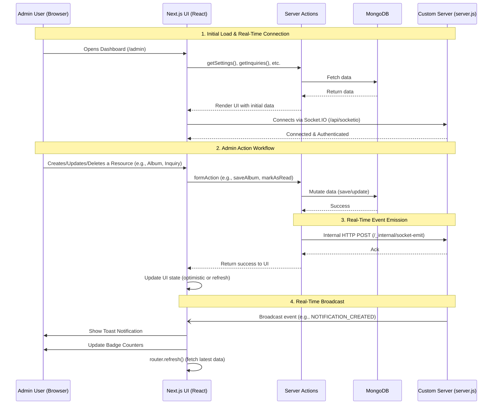

# Legend Photography Admin Dashboard Workflow

This document outlines the architecture and workflow of the Legend Photography Admin Dashboard, specifically highlighting the integration between the UI, Next.js Server Actions, MongoDB, and the custom Socket.IO real-time server.

## Components Breakdown

1. **Next.js UI (`src/app/admin`)**: Renders the dashboard and manages local state.
2. **Server Actions (`src/app/admin/actions/*.ts`)**: Handles database mutations securely on the server.
3. **MongoDB**: The single source of truth for all data.
4. **Custom Server (`server.js`)**: A custom Node.js server that wraps Next.js and runs the Socket.IO instance for real-time WebSocket connections.
5. **Socket Emitter (`src/lib/socketEmit.ts`)**: A utility used by Server Actions to trigger socket events via an internal HTTP endpoint on `server.js`.
6. **Realtime Listeners (`RealtimeEventHandler`, `NotificationsMenu`)**: Client components that listen for Socket.IO events and trigger UI updates/refreshes.
