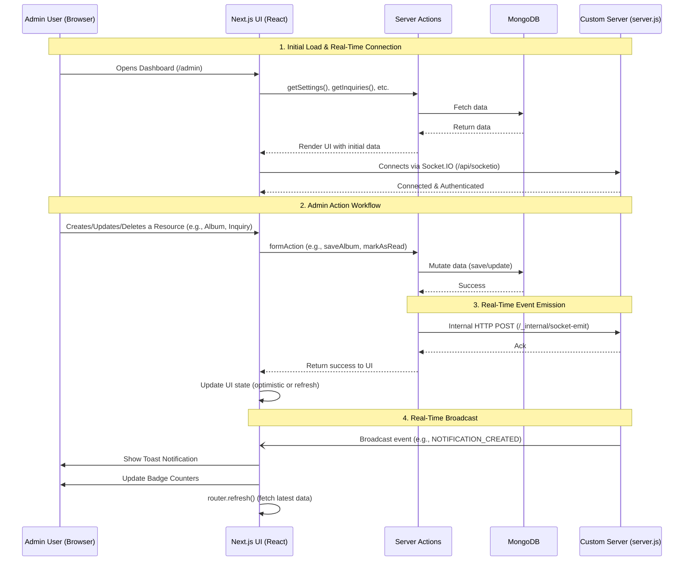

# Legend Photography Admin Dashboard Workflow

This document outlines the architecture and workflow of the Legend Photography Admin Dashboard, specifically highlighting the integration between the UI, Next.js Server Actions, MongoDB, and the custom Socket.IO real-time server.

## Detailed Architecture Explanation

### 1. Hybrid Server Architecture (Next.js + Socket.IO)
Next.js inherently runs in a serverless environment where continuous background processes (like WebSockets) are difficult to maintain. To solve this, we use a **custom server architecture** (`server.js`). 
- `server.js` starts a standard Node HTTP server.
- It attaches both the Next.js request handler AND the Socket.IO server to the same port (3000).
- This allows our frontend to connect to `/api/socketio` securely using WebSockets without spinning up a separate backend port.

### 2. Secure Real-Time Authentication
- When an admin logs in, a JWT session is stored in an HTTP-only cookie.
- When the Socket.IO client (in the browser) attempts to connect, it passes this token.
- `server.js` verifies this token against the `JWT_SECRET` environment variable before allowing the connection. If verification fails, the connection is immediately rejected, ensuring malicious actors cannot listen to real-time events.

### 3. Server Actions & MongoDB (The Data Layer)
- We use **Next.js Server Actions** (`actions.ts` files) for all CRUD (Create, Read, Update, Delete) operations instead of traditional API routes. 
- These actions connect directly to **MongoDB** using Mongoose. 
- Server Actions are highly secure and provide end-to-end type safety between the frontend form and the database.

### 4. The Real-Time Bridge (Socket Emit)
Because Server Actions run in ephemeral execution contexts, they don't have direct access to the long-running Socket.IO instance attached to `server.js`.
- When an admin updates data (e.g., marks an inquiry as read), the Server Action saves this to MongoDB.
- To notify other admins (or other tabs) in real-time, the Server Action calls `emitSocketEvent()` (from `src/lib/socketEmit.ts`).
- This function makes a secure POST request to a hidden route `/_internal/socket-emit` hosted on `server.js`.
- `server.js` receives this HTTP request, authenticates it via an internal secret, and then **broadcasts** the Socket.IO event to all connected admin clients.

### 5. Client-Side Reactivity
- **RealtimeEventHandler.tsx**: A global component wrapped around the dashboard layout. It listens for socket events (like `PORTFOLIO_CREATED`, `INQUIRY_UPDATED`). When an event occurs, it automatically triggers a Toast notification and calls `router.refresh()`, updating the screen data instantly without a full page reload.
- **NotificationsMenu.tsx**: Listens to the `NOTIFICATION_CREATED` event specifically. When a new inquiry arrives, the bell icon updates its count in real-time without needing to constantly poll the database.
