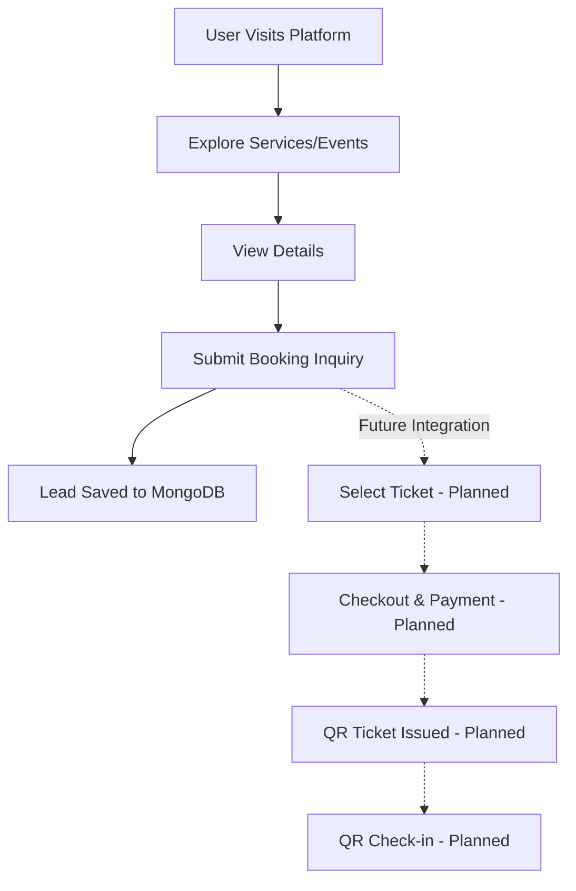

# Event Management System — Technical & Project Documentation

| Field | Value |
|---|---|
| **Project** | Event Management System (Currently: Legend Photography Portfolio & Inquiry Engine) |
| **Architecture** | Serverless / API-First |
| **Frontend** | Next.js 16 (App Router) + React 19 + Tailwind CSS v4 + GSAP |
| **Backend** | Next.js API Routes (Node.js/Serverless) + Express Fallback |
| **Database** | MongoDB (via Mongoose) |
| **Status** | Production (Phase 1: Portfolio & Lead Generation) |
| **Documentation Version**| 1.0.0 |

---

## Table of Contents
1. [Project Overview](#1-project-overview)
2. [Problem Statement](#2-problem-statement)
3. [Proposed Solution](#3-proposed-solution)
4. [Project Objectives](#4-project-objectives)
5. [Scope](#5-scope)
6. [User Roles](#6-user-roles)
7. [Functional Requirements](#7-functional-requirements)
8. [Non-Functional Requirements](#8-non-functional-requirements)
9. [Feature Modules](#9-feature-modules)
10. [System Workflow](#10-system-workflow)
11. [User Journeys](#11-user-journeys)
12. [System Architecture](#12-system-architecture)
13. [Frontend Architecture](#13-frontend-architecture)
14. [Backend Architecture](#14-backend-architecture)
15. [Database Architecture](#15-database-architecture)
16. [API Architecture](#16-api-architecture)
17. [Authentication & Authorization](#17-authentication--authorization)
18. [Booking & Ticketing](#18-booking--ticketing)
19. [Payment Architecture](#19-payment-architecture)
20. [QR Ticket & Check-in](#20-qr-ticket--check-in)
21. [Notification System](#21-notification-system)
22. [Analytics](#22-analytics)
23. [UI/UX Design](#23-uiux-design)
24. [Animation System](#24-animation-system)
25. [Responsive Design](#25-responsive-design)
26. [Performance](#26-performance)
27. [Security](#27-security)
28. [Error Handling](#28-error-handling)
29. [Validation](#29-validation)
30. [Deployment Architecture](#30-deployment-architecture)
31. [Environment Variables](#31-environment-variables)
32. [Testing](#32-testing)
33. [Engineering Problems](#33-engineering-problems)
34. [Solutions Implemented](#34-solutions-implemented)
35. [Technical Decisions & Trade-offs](#35-technical-decisions--trade-offs)
36. [Known Limitations](#36-known-limitations)
37. [Future Enhancements](#37-future-enhancements)
38. [Maintenance & Scalability](#38-maintenance--scalability)
39. [Project Structure](#39-project-structure)
40. [Conclusion](#40-conclusion)

---

## 1. Project Overview
The **Event Management System** is envisioned as a comprehensive platform designed to manage the entire lifecycle of events, specifically tailored for premium photography and event services. It is designed for Attendees (clients booking services/events), Organizers (the studio), and Admins.

**Core Lifecycle Managed:**
Event/Service Discovery → Event Details → Registration / Booking Inquiry (Currently Implemented) 
*(Future: Ticket Selection → Payment → Booking Confirmation → Digital QR Ticket → Event Day Check-in → Attendance → Review → Analytics).*

---

## 2. Problem Statement

| Problem | Impact | Who is Affected | Consequence |
|---|---|---|---|
| **Scattered service/event information** | Users depend on multiple platforms to find portfolios and pricing. | Attendees | High bounce rates; loss of potential leads. |
| **Manual booking/inquiries** | Data entry via phone/WhatsApp is disorganized. | Organizers & Attendees | Slow response times; error-prone scheduling. |
| **Manual ticket verification** | Checking guests in via paper lists is slow. | Organizers | Event entry bottlenecks. *(Planned Scope)* |
| **Limited performance visibility**| Organizers cannot easily measure lead conversion or sales. | Organizers | Inability to scale business based on data. |

---

## 3. Proposed Solution

| Problem | Proposed Solution | Module | Status |
|---|---|---|---|
| Scattered event information | Centralized cinematic portfolio and service dashboard | Event Discovery | **Implemented** |
| Manual booking/inquiries | Online, database-backed booking inquiry flow | Lead Generation | **Implemented** |
| Manual ticket verification | QR-based check-in app | Check-in | *Planned* |
| Poor visibility | Automated revenue & attendance analytics dashboard | Analytics | *Planned* |

---

## 4. Project Objectives
- **Centralize event and service discovery** via a high-performance frontend.
- **Simplify booking inquiries** by capturing structured data directly to a database.
- **Provide a responsive, cinematic user experience** using GSAP animations.
- **Protect user information** via secure API validations.
- *(Future)* **Enable complete online ticket booking and payment.**
- *(Future)* **Provide digital QR tickets and check-in apps.**
- *(Future)* **Provide organizer analytics for revenue tracking.**

---

## 5. Scope

### In Scope (Implemented)
- High-performance, GSAP-animated UI/UX.
- Categorized portfolio and service listings.
- Booking inquiry form with Mongoose schema validation.
- MongoDB integration via Next.js serverless API routes.
- Mobile-first responsive design.
- SEO optimizations via Next.js metadata.

### Planned Scope
- User/Organizer/Admin authentication (JWT/NextAuth).
- Event creation and ticket configuration.
- Payment gateway integration (e.g., Stripe/Razorpay).
- Digital QR ticket generation and check-in scanning.
- Analytics dashboards and email notifications.

### Out of Scope
- Native iOS/Android mobile applications (Focus is exclusively on responsive web).
- Third-party CRM synchronization (Salesforce, Hubspot, etc.).

---

## 6. User Roles

| Capability | Attendee | Organizer | Admin |
|---|:---:|:---:|:---:|
| Browse events/services | ✓ | ✓ | ✓ |
| Submit inquiries | ✓ | — | — |
| Manage inquiries | — | ✓ | ✓ |
| Create events (Planned) | — | ✓ | ✓ |
| Book tickets (Planned) | ✓ | — | — |
| Scan QR / Check-in (Planned)| — | ✓ | ✓ |
| Platform configuration (Planned)| — | — | ✓ |

---

## 7. Functional Requirements

| ID | Requirement | Module | Role | Priority | Status |
|---|---|---|---|---|---|
| FR-001 | View cinematic portfolios | Discovery | Attendee | High | **Implemented** |
| FR-002 | View service details & pricing | Discovery | Attendee | High | **Implemented** |
| FR-003 | Submit booking inquiry | Booking | Attendee | High | **Implemented** |
| FR-004 | Validate inquiry payloads | API | System | High | **Implemented** |
| FR-005 | Store leads in database | Database | Organizer | High | **Implemented** |
| FR-006 | User Registration & Login | Auth | All | High | *Planned* |
| FR-007 | Create/Edit Events | Events | Organizer | High | *Planned* |
| FR-008 | Checkout & Payment | Payment | Attendee | High | *Planned* |
| FR-009 | Generate QR Ticket | Tickets | System | High | *Planned* |
| FR-010 | Scan QR Code | Check-in | Organizer | High | *Planned* |
| FR-011 | Revenue Dashboard | Analytics| Organizer | Med | *Planned* |

---

## 8. Non-Functional Requirements

| Requirement | Description | Implementation Details |
|---|---|---|
| **Performance** | Fast initial loads; smooth 60fps animations. | Utilizes Next.js SSG and GSAP `ScrollTrigger`. |
| **Security** | Protect database connection strings. | Stored strictly in `.env.local`, never exposed to client. |
| **Responsiveness**| Must function seamlessly on mobile and desktop. | Tailwind CSS breakpoints used for fluid masonry layouts. |
| **Maintainability**| Clear component separation. | React 19 functional components mapped in `src/components`. |
| **SEO** | High visibility on search engines. | Next.js App Router metadata API utilized on page layouts. |

---

## 9. Feature Modules

| Module | Purpose | Users | Inputs | Outputs | Status |
|---|---|---|---|---|---|
| **Event Discovery** | Browse available services/events | Attendees | UI Clicks | Portfolios | **Implemented** |
| **Booking Inquiry** | Capture lead data | Attendees | Form Data | DB Document | **Implemented** |
| **Authentication** | Secure access control | All roles | Credentials | JWT Session | *Planned* |
| **Event Management**| Create and publish events | Organizer | Event Data | Event Listing | *Planned* |
| **Payment Gateway** | Process ticket sales | Attendees | Credit Card | Receipt | *Planned* |
| **QR Check-in** | Secure venue entry | Organizer | QR Scan | Validation | *Planned* |
| **Analytics** | Revenue and tracking | Organizer | N/A | Charts | *Planned* |

---

## 10. System Workflow



---

## 11. User Journeys
1. **The Discovery Journey (Implemented):** An Attendee lands on the homepage, triggers GSAP hero animations, scrolls through masonry portfolio grids, and clicks through to service details.
2. **The Inquiry Journey (Implemented):** The Attendee fills out the contact form. Mongoose validates the payload via the Next.js API, and a success response confirms the lead is saved for the Organizer.
3. **The Transactional Journey (Planned):** An Attendee adds a ticket to cart, authenticates, pays via Stripe, and receives an email with a QR code.

---

## 12. System Architecture
The application uses a modern decoupled Serverless architecture hosted on Vercel's Edge network, communicating with a managed MongoDB cluster.

---

## 13. Frontend Architecture
- **Framework:** Next.js 16 App Router.
- **Library:** React 19.
- **Styling:** Tailwind CSS v4.
- **Animation:** GSAP & `@gsap/react`.
- **Media:** `next/image` for WebP optimization.

---

## 14. Backend Architecture
- **Framework:** Next.js API Routes (`src/app/api`).
- **Alternative:** An Express fallback (`server/index.js`) is provided for custom server deployments.
- **Environment:** Node.js serverless functions.

---

## 15. Database Architecture
- **Provider:** MongoDB Atlas.
- **ODM:** Mongoose.
- The `Inquiry` schema validates required fields (`name`, `phone`, `service`) before document creation.

---

## 16. API Architecture

| Endpoint | Method | Payload | Response | Status |
|---|---|---|---|---|
| `/api/inquiries` | `POST` | `{name, phone, service, ...}` | `201 Created` | **Implemented** |
| `/api/auth/login` | `POST` | `{email, password}` | JWT Token | *Planned* |
| `/api/events` | `GET/POST`| Event JSON | Event Object | *Planned* |
| `/api/tickets/scan`| `POST` | `{ qrHash }` | Validation Status | *Planned* |

---

## 17. Authentication & Authorization
**Status: Planned / Future Scope**
Currently, routes are public. Future iterations will introduce NextAuth.js to protect Organizer dashboard routes (`/admin`, `/dashboard`) using JSON Web Tokens (JWT).

---

## 18. Booking & Ticketing
**Status: Planned / Future Scope**
Currently handles general service inquiries. Will be expanded to manage limited ticket inventory, dynamic pricing tiers, and cart sessions.

---

## 19. Payment Architecture
**Status: Planned / Future Scope**
Will integrate with Stripe/Razorpay. The frontend will generate checkout sessions, and a secure backend webhook will listen for `payment_intent.succeeded` to finalize bookings.

---

## 20. QR Ticket & Check-in
**Status: Planned / Future Scope**
Successful payments will trigger the generation of a cryptographic hash embedded in a QR code. Organizers will use a camera-enabled web UI to scan and validate these codes against the backend database.

---

## 21. Notification System
**Status: Planned / Future Scope**
Integration with Nodemailer (or SendGrid/AWS SES) is planned to send automatic email confirmations for inquiries, bookings, and payments.

---

## 22. Analytics
**Status: Planned / Future Scope**
The Organizer dashboard will utilize charting libraries (e.g., Recharts) to visualize lead conversions, ticket sales, and attendance rates based on MongoDB aggregations.

---

## 23. UI/UX Design
The design is dark-themed and highly cinematic, prioritizing large-format photography. Typography and negative space are used to create a premium, high-end feel suited for visual artists and premium event organizers.

---

## 24. Animation System
The animation system is strictly driven by **GSAP**. 
- `ScrollTrigger` is used to fade and slide elements as they enter the viewport.
- Staggered reveals are used on masonry grids to prevent jarring content loads.
- Parallax effects are applied to hero banners.

---

## 25. Responsive Design
Tailwind CSS provides mobile-first media queries (`md:`, `lg:`). Complex desktop masonry grids gracefully collapse into single-column or simplified grid feeds on mobile to ensure usability without horizontal scrolling.

---

## 26. Performance
- **Image Optimization:** All heavy media files run through `next/image`, serving WebP formats and preventing Cumulative Layout Shift (CLS).
- **Edge Delivery:** Deployed on Vercel for global caching and minimal latency.

---

## 27. Security
- API endpoints do not trust client data; all data is re-validated through Mongoose.
- Database URIs are excluded from version control via `.gitignore`.
- Planned implementation of CORS restrictions and Rate Limiting for the API.

---

## 28. Error Handling
The backend uses standard `try/catch` blocks.
- Missing required fields return `400 Bad Request`.
- Database connection failures return `500 Internal Server Error`.
- The frontend catches these HTTP codes and displays graceful error UI states rather than crashing.

---

## 29. Validation
Mongoose Schemas define strict types (`String`, `Enum`) and `required: true` properties for incoming leads, ensuring corrupted or incomplete data cannot enter the database.

---

## 30. Deployment Architecture
Designed for **Vercel**. Vercel detects the Next.js framework, automatically builds the React frontend for static delivery, and deploys the `src/app/api` routes as Serverless Functions.

---

## 31. Environment Variables
```env
MONGODB_URI=mongodb+srv://<user>:<password>@cluster.mongodb.net/dbname
PORT=4000 # Optional for local Express fallback
```
*Note: Never commit `.env.local`.*

---

## 32. Testing
**Status: Planned / Future Scope**
Currently reliant on manual QA. Planned integration of **Jest** for API unit tests and **Cypress** for end-to-end critical path testing (Inquiry submission, booking flow).

---

## 33. Engineering Problems
1. **Layout Shifts:** Loading high-res photography caused severe layout jumping.
2. **Scroll Jank:** Initial CSS animations on scroll caused frame drops on mobile.
3. **Flexible Schema:** Form requirements change rapidly for event services.

---

## 34. Solutions Implemented
1. Enforced strict aspect ratios and utilized `next/image` to reserve DOM space before image load.
2. Migrated all scroll animations to GSAP `ScrollTrigger` which utilizes hardware-accelerated transforms.
3. Implemented MongoDB/Mongoose NoSQL schema to allow fluid addition of new inquiry fields without complex migrations.

---

## 35. Technical Decisions & Trade-offs
- **Trade-off:** Chose Next.js App Router over Pages router. *Reason:* Better server components architecture and SEO, despite a steeper learning curve.
- **Trade-off:** Chose MongoDB over PostgreSQL. *Reason:* High flexibility for evolving event and lead schemas without strict relational migrations.
- **Trade-off:** Used GSAP instead of Framer Motion. *Reason:* GSAP provides more granular control over complex staggered timeline animations.

---

## 36. Known Limitations
- Media assets are currently static in the `public` folder; requires developer intervention to update portfolios.
- No automated email response is sent to the user upon inquiry submission.

---

## 37. Future Enhancements
- Integration of a Headless CMS (Sanity/Strapi) for non-technical organizers to update images.
- Full execution of the planned Authentication, Ticketing, and Payment modules.

---

## 38. Maintenance & Scalability
- The serverless architecture ensures the platform can scale infinitely during traffic spikes (e.g., ticket drops).
- Dependencies (React 19, Next 16) should be audited periodically for breaking changes or security patches.
- MongoDB indexes should be added to `eventDate` and `status` fields as the `Inquiries` collection grows.

---

## 39. Project Structure
```text
/src
  /app           # Next.js App Router (Pages & API)
    /api         # Serverless endpoints
    /contact     # Lead generation route
    /portfolio   # Event discovery routes
  /components    # Reusable React UI & GSAP components
/server          # Express fallback server
/public          # Static assets (images, videos)
```

---

## 40. Conclusion
The current iteration of the system effectively solves the problem of premium media presentation combined with centralized lead generation. By leveraging Next.js, GSAP, and MongoDB, the codebase establishes a robust, highly scalable foundation fully prepared for its evolution into a comprehensive Event Management, Ticketing, and Analytics platform.
