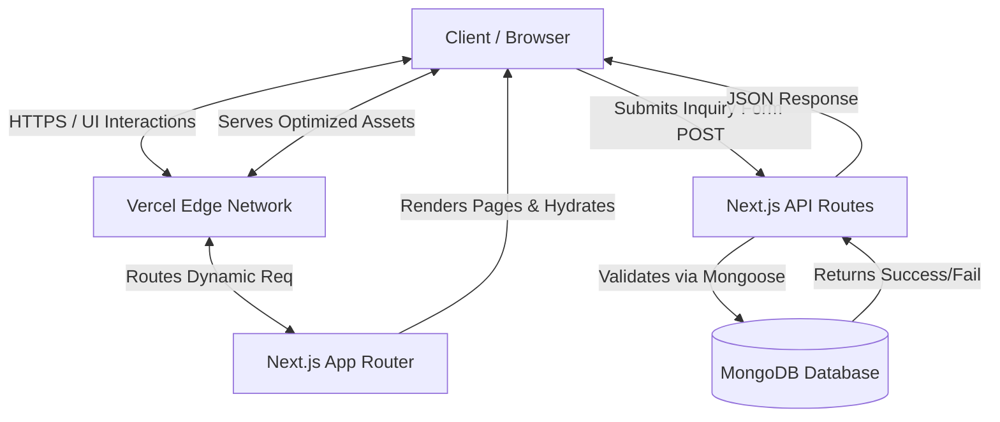

<div align="center">
  <h1>Legend Photography</h1>
  <p>A modern, cinematic photography portfolio and booking platform built with Next.js, Tailwind CSS, GSAP, and MongoDB.</p>

  
  
  
  
  
  
  
  <br>
  
  
  
  
  
  
  
  <br>
  
  
  
  
</div>

---

## 🎥 Project Showcase

<div align="center">
  <h3><a href="https://github.com/kasimshah19/Legend-Photography/raw/master/src/screenshot/Legend%20Photography%20_%20Wedding%20%26%20Pre-Wedding%20Photography%20-%20Google%20Chrome%202026-09-25%2022-02-01.mp4">▶️ Watch / Download Cinematic Demo Video</a></h3>

  <p><i>A cinematic walkthrough of the Legend Photography portfolio.</i></p>
</div>

---

## Live Demo

Experience the cinematic photography portfolio live:

**Vercel Production Deployment**: [https://legend-photography.vercel.app](https://legend-photography.vercel.app)

*(The application is deployed on Vercel's Edge Network as a full-stack Next.js application. You can explore the GSAP-powered animations, view the masonry portfolio grids, and test the MongoDB-connected inquiry forms on the live site.)*

---

## Overview

**Legend Photography** is a premium digital portfolio and booking platform designed for a high-end photography studio specializing in weddings, pre-weddings, candid, maternity, portraits, and event photography. 

The website aims to deliver an immersive, cinematic experience that mirrors the quality of the studio's photography. It allows potential clients to explore categorized portfolios, view video films/reels, compare service packages, and submit booking inquiries seamlessly.

## Problem Statement

Traditional photography websites often struggle to balance high-quality visual storytelling with performance. They typically suffer from:
- Slow loading times due to unoptimized, heavy high-resolution images.
- Clunky navigation that interrupts the emotional journey of viewing a portfolio.
- Disconnected inquiry flows that make booking a session difficult.
- Lack of cinematic motion, making the digital presence feel static and cheap.

## Solution

This platform resolves these issues by utilizing a modern tech stack (Next.js App Router). It leverages advanced image optimization (`next/image`), layout shifts prevention, and static site generation to guarantee fast load times without sacrificing image quality. 

To create a premium feel, GSAP (GreenSock Animation Platform) is heavily integrated for smooth scroll reveals, hero interactions, and page transitions, ensuring performance isn't compromised. The inquiry process is streamlined into a seamless form connected to a MongoDB backend for secure lead tracking, supplemented by direct WhatsApp and phone integrations.

## Features

### User Experience
- **Cinematic Interactions**: Premium scroll animations, parallax effects, and smooth reveals powered by GSAP.
- **Responsive Navigation**: Adaptive mobile-first menu and structured routing.
- **Dark/Light Theming Elements**: High-contrast, elegant UI suited for visual media.

### Portfolio & Media
- **Masonry Grid Gallery**: Optimized, staggered image grids for portfolio display.
- **Integrated Lightbox**: Full-screen image viewing experience.
- **Album Details**: Dedicated pages for specific shoots (e.g., weddings, maternity).
- **Films / Reels Section**: Support for video embeds and highlight reels.

### Services & Pricing
- **Structured Service Categories**: Clear breakdowns of offerings.
- **Package Comparisons**: Tiered pricing tables for different event types.
- **Process Timeline**: Visual step-by-step guide of the client journey.
- **FAQ Accordion**: Expandable questions and answers.

### Contact & Lead Generation
- **Inquiry Form**: Validated booking form that submits directly to the database.
- **Direct Messaging**: One-click WhatsApp integration with pre-filled messages.
- **Quick Call**: Integrated `tel:` links for immediate contact.

### Performance & SEO
- **Media Optimization**: Next.js automatic image optimization and lazy loading.
- **Server-Side Rendering (SSR)**: Enhanced initial load and crawler indexing.
- **Static Site Generation (SSG)**: Pre-rendered static pages for blazing fast delivery.
- **Structured Metadata**: Dynamic SEO tags and Open Graph data for social sharing.

## Tech Stack

| Layer | Technology | Purpose |
|---|---|---|
| **Frontend** | Next.js (App Router) | React framework for UI, routing, SSR, SSG, and SEO |
| **UI Library** | React 19 | Component architecture and state management |
| **Styling** | Tailwind CSS v4 | Utility-first responsive styling |
| **Animation** | GSAP & `@gsap/react` | High-performance, cinematic UI animations |
| **Backend** | Next.js API Routes | Serverless functions for form handling |
| **Database** | MongoDB | Persistent storage for booking inquiries |
| **ODM** | Mongoose | Schema validation and database modeling |
| **Deployment**| Vercel | Edge network delivery and CI/CD hosting |

## System Architecture



## Security Considerations

- **Database Credentials**: MongoDB URIs and secrets are stored strictly in environment variables (`.env.local`) and are never exposed to the client bundle.
- **API Protection**: API routes utilize proper request parsing and Mongoose schema validation to prevent injection attacks and malformed data.
- **CORS & Headers**: Managed natively by Next.js to ensure requests are securely processed on the same origin.

## Local Development

1. **Clone the repository**:
   ```bash
   git clone https://github.com/kasimshah19/Legend-Photography.git
   cd legend-photography
   ```

2. **Install dependencies**:
   ```bash
   npm install
   ```

3. **Configure Environment Variables**:
   Copy `.env.example` to `.env.local` and fill in your details:
   ```bash
   cp .env.example .env.local
   ```
   *(Note: The `MONGODB_URI` must be a valid MongoDB connection string to enable inquiry form saving. Do not commit `.env.local` to version control.)*

4. **Run the development server**:
   ```bash
   npm run dev
   ```

5. Open [http://localhost:3000](http://localhost:3000) in your browser.

## Deployment

This project is optimized for deployment on Vercel.

1. Connect the GitHub repository to Vercel.
2. Ensure the framework preset is set to **Next.js**.
3. Add the environment variables from `.env.local` to the Vercel project settings.
4. Deploy. Vercel will automatically build the project and deploy both the frontend pages and the serverless API routes.

## Future Improvements

- Add a headless CMS (like Sanity or Strapi) to allow the studio owner to upload new portfolio images without code changes.
- Implement an authentication portal for clients to view private, password-protected galleries.
- Integrate a real-time calendar availability API (like Calendly) for immediate booking.

---

## Author

**Kasim Shah**

**Connect with me:**
- Portfolio: [kasim-portfolio-umber.vercel.app](https://kasim-portfolio-umber.vercel.app/)
- LinkedIn: [Kasim Shah](https://www.linkedin.com/in/kasim-shah-176175340/)
- GitHub: [@kasimshah19](https://github.com/kasimshah19)

---
*Developed for Legend Photography.*
