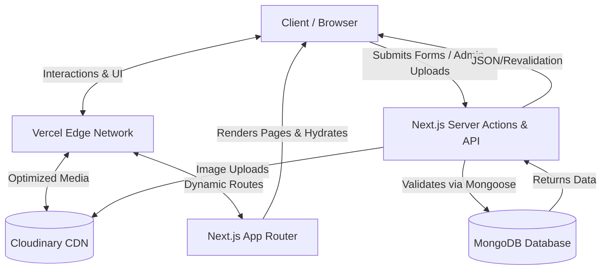

<div align="center">
  <h1>Legend Photography</h1>
  <p>A modern, cinematic photography portfolio and full-stack bespoke CMS built with Next.js, Tailwind CSS, GSAP, and MongoDB.</p>

  <p><strong>🌐 Live Website: <a href="https://legend-photography.onrender.com">https://legend-photography.onrender.com</a></strong></p>

  
  
  
  
  
  
  <br>
  
  
  
  
  
  
  <br>
  
  
  
</div>

---

## 🎥 Project Showcase

<div align="center">
  <h3><a href="https://github.com/kasimshah19/Legend-Photography/raw/master/src/screenshot/Legend%20Photography%20_%20Wedding%20%26%20Pre-Wedding%20Photography%20-%20Google%20Chrome%202026-09-25%2022-02-01.mp4">▶️ Watch / Download Cinematic Demo Video</a></h3>
  <p><i>A cinematic walkthrough of the Legend Photography portfolio.</i></p>
</div>

---

## Overview

**Legend Photography** is a premium digital portfolio, booking platform, and custom Content Management System (CMS) designed for a high-end photography studio. 

The website delivers an immersive, cinematic experience for potential clients (via GSAP animations and masonry layouts) while providing the studio owners with a powerful, secure, and bespoke **Admin Dashboard** to manage their entire business operations without touching code.

## 🚀 Key Features

### 1. Front-End: Cinematic Client Experience
- **Cinematic Interactions**: Smooth scroll reveals, parallax media effects, and zero-latency cursor tracking powered by GSAP.
- **Masonry Portfolio Grids**: Fully optimized, dynamic staggering image galleries using `next/image` and Cloudinary.
- **Seamless Lead Generation**: Frictionless, database-backed inquiry forms with rate-limiting and anti-spam measures.
- **Dynamic Content**: Every visible piece of content—from Hero texts to featured films and pricing packages—is dynamically injected from the database.

### 2. Back-End: Bespoke Admin Dashboard & CMS
We built a complete, secure backend infrastructure (Phases 57-70) that replaces the need for third-party tools like Sanity or WordPress:
- **Authentication & RBAC**: Custom JWT-based session management with strict Role-Based Access Control (`SUPER_ADMIN`, `ADMIN`, `EDITOR`).
- **Portfolio & Media Library CMS**: Direct integration with Cloudinary. Admins can upload, preview, reorder, draft, and publish albums and high-res media instantly.
- **Inquiry Management**: A full CRM-like dashboard to track, filter, and update the status of client inquiries (New, Contacted, Booked, Archived).
- **Films & Services CMS**: Full CRUD capabilities for video reels (YouTube/Vimeo extraction) and dynamic pricing packages.
- **Site Settings & Homepage Controls**: Global control over business contact info, footer text, and homepage featured sections.
- **Audit Logs & Notifications**: Automated tracking of all admin actions (who did what and when) and real-time polling for new inquiries.
- **Production Security Hardening**: API rate-limiting, MongoDB IDOR checks, CSRF mitigation, and strict payload validation.

## Tech Stack

| Layer | Technology | Purpose |
|---|---|---|
| **Frontend** | Next.js (App Router), React 19 | UI, routing, SSR/SSG, and SEO |
| **Styling** | Tailwind CSS v4 | Utility-first responsive styling |
| **Animation** | GSAP & `@gsap/react` | High-performance, cinematic UI animations |
| **Backend** | Next.js Server Actions & API | Serverless functions, form handling, auth |
| **Database** | MongoDB & Mongoose | Persistent storage, models, and relations |
| **Media** | Cloudinary | High-performance CDN for image/video hosting |
| **Security** | bcryptjs, jose | Password hashing and JWT session management |

## System Architecture


```mermaid
flowchart TD
    Client[Client / Browser]
    VercelEdge[Vercel Edge Network]
    NextApp[Next.js App Router]
    NextAPI[Next.js Server Actions & API]
    MongoDB[(MongoDB Database)]
    Cloudinary[(Cloudinary CDN)]

    Client <-->|Interactions & UI| VercelEdge
    VercelEdge <-->|Optimized Media| Cloudinary
    VercelEdge <-->|Dynamic Routes| NextApp
    NextApp -->|Renders Pages & Hydrates| Client
    Client -->|Submits Forms / Admin Uploads| NextAPI
    NextAPI -->|Image Uploads| Cloudinary
    NextAPI -->|Validates via Mongoose| MongoDB
    MongoDB -->|Returns Data| NextAPI
    NextAPI -->|JSON/Revalidation| Client
```

## Local Development

1. **Clone the repository**:
   ```bash
   git clone https://github.com/kasimshah19/Legend-Photography.git
   cd Legend-Photography-master
   ```

2. **Install dependencies**:
   ```bash
   npm install
   ```

3. **Configure Environment Variables**:
   Copy `.env.example` to `.env` (or `.env.local`) and configure your MongoDB URI, JWT Secret, and Cloudinary keys.
   ```bash
   cp .env.example .env
   ```

4. **Run the development server**:
   ```bash
   npm run dev
   ```

5. **Access the Application**:
   - Public Site: [http://localhost:3000](http://localhost:3000)
   - Admin Dashboard: [http://localhost:3000/admin](http://localhost:3000/admin)

## 🧪 Testing & QA

For detailed instructions on testing the Role-Based Access Control (RBAC) implementation and to get the default test credentials (SUPER_ADMIN, ADMIN, EDITOR), please refer to the [**TESTING.md**](TESTING.md) guide.

## The Team

**Kasim Shah**  
*Co-Founder & Sales at [VierLabs](https://vierlabs.com/)*

> "Turning conversations into strategic partnerships. Kasim leads global client relationships, driving business growth and ensuring every high-end digital project starts with a profound understanding of the brand's core vision. With a sharp focus on sales strategy and client success, he bridges the gap between technical execution and business objectives at VierLabs."

**Connect with Kasim:**
- VierLabs: [vierlabs.com](https://vierlabs.com/)
- Portfolio: [kasim-portfolio-umber.vercel.app](https://kasim-portfolio-umber.vercel.app/)
- LinkedIn: [Kasim Shah](https://www.linkedin.com/in/kasim-shah-176175340/)
- GitHub: [@kasimshah19](https://github.com/kasimshah19)

---

**Sohel Shaikh**  
*Co-Founder & Strategy at [VierLabs](https://vierlabs.com/)*

> "Turning complex technical challenges into elegant, scalable solutions. Sohel leads product strategy and development at VierLabs, architecting robust digital platforms that merge cutting-edge technology with seamless user experiences. With a deep expertise in engineering and product vision, he ensures every solution is built for maximum performance, reliability, and long-term success."

**Connect with Sohel:**
- LinkedIn: [mo-sohel](https://www.linkedin.com/in/mo-sohel/)
- GitHub: [@m-sohel](https://github.com/m-sohel)

---

## License

This project is licensed under the [MIT License](LICENSE).

<div align="center">
  <em>© 2026 Legend Photography. All rights reserved.</em><br>
  <em>Designed & Built by Kasim Shah & Sohel Shaikh</em>
</div>
