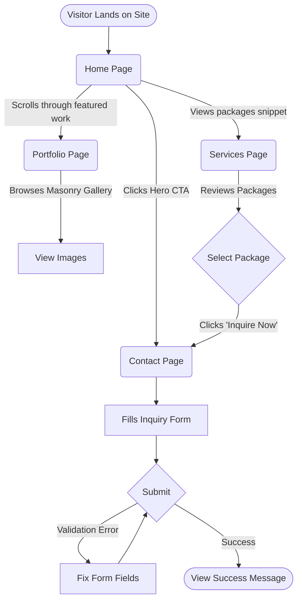

# User Flow
**Purpose**: Show the major journey pathways a visitor takes when browsing the website.
**Scope**: High-level interaction flow from entry to conversion (inquiry).

**Explanation**: 
Visitors primarily land on the home page, where they are introduced to the cinematic experience. From there, they can diverge into viewing the full photography portfolio or examining specific pricing packages in the Services section. All conversion pathways eventually lead to the Contact page to submit an inquiry for a booking.

**Source References**:
- `src/app/page.tsx`
- `src/app/portfolio/page.tsx`
- `src/app/services/page.tsx`
- `src/app/contact/page.tsx`
