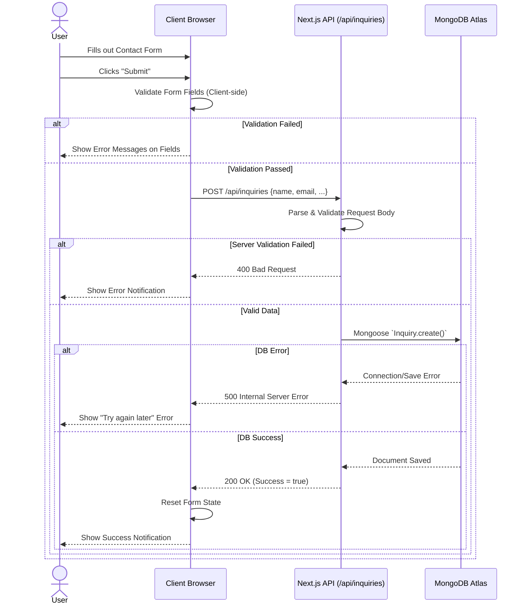

# Contact / Inquiry Sequence
**Purpose**: Detail the step-by-step communication between the client, frontend, and database during an inquiry.
**Scope**: Form submission sequence on the `/contact` page.

**Explanation**: 
This sequence ensures bad data is caught quickly on the frontend, but ultimately relies on backend Mongoose schema validations before data is inserted into MongoDB. The user is provided real-time UI feedback for every state (loading, error, success).

**Source References**:
- `src/app/contact/page.tsx`
- `server/index.js` (or `src/app/api/inquiries/route.ts`)
- MongoDB Schema Configuration
