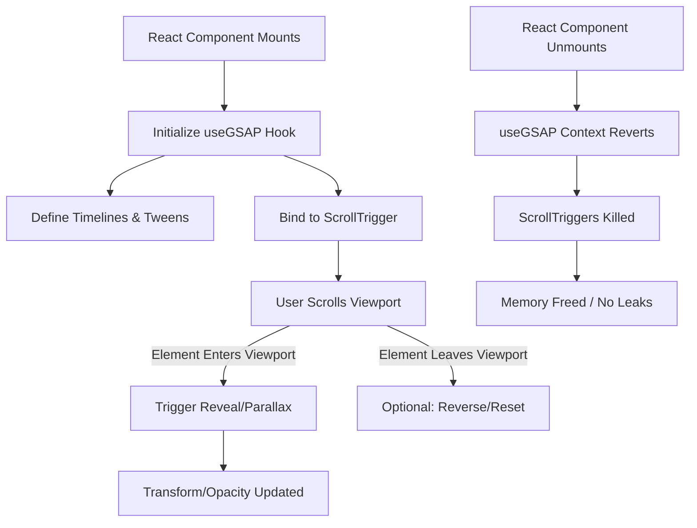

# GSAP Animation Flow
**Purpose**: Document the lifecycle and management of GSAP animations within the React environment.
**Scope**: How animations are initialized, triggered on scroll, and cleaned up to prevent memory leaks.

**Explanation**: 
To safely use GSAP inside Next.js and React 19 (which uses Strict Mode), the `@gsap/react` plugin is utilized. The `useGSAP()` hook acts as a safe execution context. When a component unmounts (e.g. during a route change), the context automatically cleans up all associated tweens and `ScrollTrigger` instances, ensuring that no lingering listeners degrade application performance.

**Source References**:
- Global layouts and heavily animated page sections
- Uses `@gsap/react` and `gsap/ScrollTrigger`
